# 🚀 OpenShift 4.18 Baremetal Installation

This guide provides a step-by-step walkthrough for deploying an OpenShift 4.18 cluster on baremetal.

---

## ✅ Overview

- **Cluster Topology:**
  - 1 x Bootstrap Node (Temporary) 
  - 3 x Control Plane (Master) Nodes
  - 2 x Compute (Worker) Nodes
  - 1 x HAProxy Load Balancer (CentOS10)
  - 1 x DNS+DHCP Server + Bastion Host (CentOS10)

- **Platform:** It can be installed on any platform like, baremetal, KVM, VMware, proxmox etc.
- **Domain:** `BM.tayyabtahir.com`


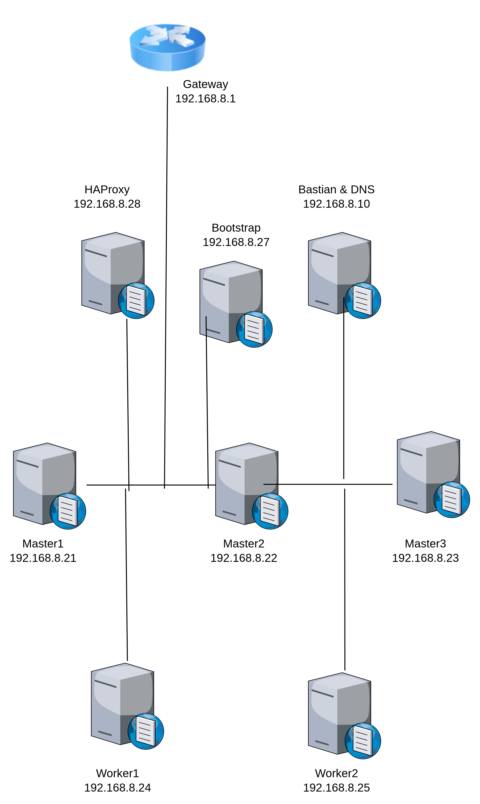


---
## Important: Openshift installation depend on these 2 dns records, they should be redirected to haproxy and haproxy should redirect them to all master nodes.
* api-int.ocp4.tayyabtahir.com
* api.ocp4.tayyabtahir.com

These records are mandatory, all other records are optional, but better to have them as well.

---

## 🏠 Environment Prerequisites


- Static IPs reserved for all nodes and LB
- DNS server for internal name resolution
- DHCP for IP address binding
- RHCOS ISO downloaded
- Pull secret from Red Hat account
- Bastian host SSH key.
- Internet access (for image pulling)

---

## 📝 DNS Records (Example)

| Hostname                         | IP Address       | Description       |
|----------------------------------|------------------|-------------------|
| api.bm.Tayyabtahir.com          | 192.168.8.28   | API VIP (LB)      |
| api-int.bm.Tayyabtahir.com     |  192.168.8.28    |  API-INT (LB)
| *.apps.bm.Tayyabtahir.com       | 192.168.8.28   | Ingress VIP (LB)  |
| bootstrap.bm.Tayyabtahir.com    | 192.168.8.27   | Bootstrap node    |
| master1.bm.Tayyabtahir.com | 192.168.8.21 | Master node      |
| master2.bm.Tayyabtahir.com | 192.168.8.22 | Master node      |
| master3.bm.Tayyabtahir.com | 192.168.8.23 | Master node      |
| worker1.bm.yamlforce.com | 192.168.8.24 | Worker node      |
| worker2.bm.yamlforce.com | 192.168.8.25 | Worker node      |

---

## 🚧 Tooling Setup
Set ip address, dns, gateway on Bastian host. check the selinux status, firewalld statu and then add the required ports in firewalld in Bastian host.

```bash
ip -br -c a
cat /etc/resolve.conf
getenforce
route -n
systemctl status firewalld.service
firewall-cmd --add-port=53/udp --permanent
firewall-cmd --add-port=53/tcp --permanent
firewall-cmd --add-port=80/tcp --permanent
firewall-cmd --reload
```

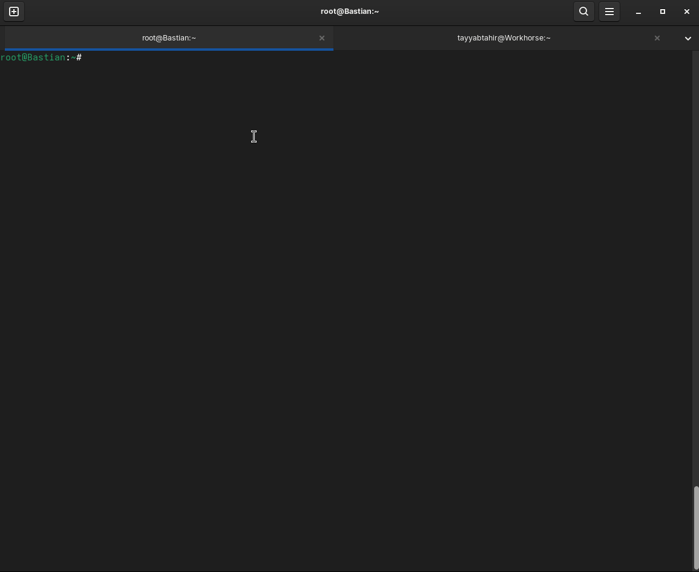


Set ip address, dns, gateway on LB host. check the selinux status, firewalld statu and then add the required ports in firewalld in LB host.

```bash
ip -br -c a
cat /etc/resolve.conf
getenforce
route -n
systemctl status firewalld.service
firewall-cmd --add-port=6443/tcp --permanent
firewall-cmd --add-port=22623/tcp --permanent
firewall-cmd --add-port=80/tcp --permanent
firewall-cmd --add-port=443/tcp --permanent
firewall-cmd --reload
```
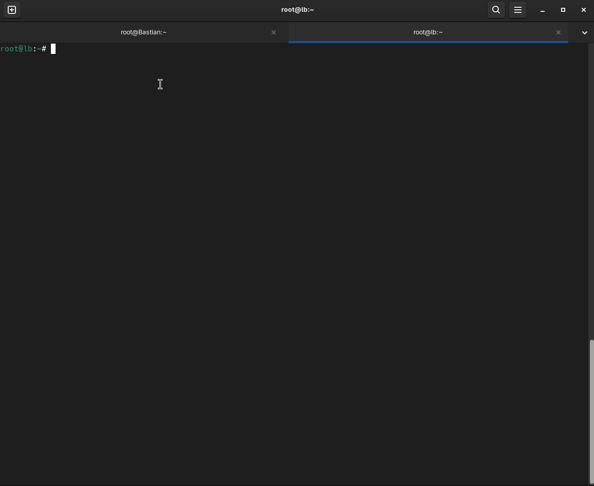


#Configure DNS and DHCP

```bash
dnf install dnsmasq -y

> /etc/dnsmasq.conf       #remove all current configs in the file.
vim /etc/dnsmasq.conf
domain-needed
bogus-priv
server=8.8.8.8
server=8.8.4.4
listen-address=192.168.8.10
no-poll
addn-hosts=/etc/dnshost
domain=bm.tayyabtahir.com
resolv-file=/etc/resolv.conf
address=/.apps.bm.tayyabtahir.com/192.168.8.28    #Wildcard DNS Record


##DHCP Configuration
dhcp-range=ens33,192.168.8.2,192.168.8.30,255.255.255.0,4m
dhcp-option=option:router,192.168.8.1
interface=ens33
dhcp-host=00:50:56:b3:a2:26,192.168.8.27

dhcp-host=00:50:56:b3:e0:58,192.168.8.21
dhcp-host=00:50:56:b3:81:04,192.168.8.22
dhcp-host=00:50:56:b3:6a:d0,192.168.8.23

dhcp-host=00:50:56:b3:f0:eb,192.168.8.24
dhcp-host=00:50:56:b3:0e:f1,192.168.8.25

```


#Configure /etc/dnshost file.

```bash
vim /etc/dnshost
192.168.8.10 bastian.bm.tayyabtahir.com bastian

192.168.8.21 master1.bm.tayyabtahir.com master1
192.168.8.22 master2.bm.tayyabtahir.com master2
192.168.8.23 master3.bm.tayyabtahir.com master3

192.168.8.24 worker1.bm.tayyabtahir.com worker1
192.168.8.25 worker2.bm.tayyabtahir.com worker2
192.168.8.26 worker3.bm.tayyabtahir.com worker3

192.168.8.27 bootstrap.bm.tayyabtahir.com bootstrap

192.168.8.28 lb.bm.tayyabtahir.com lb
 

192.168.8.28 api.bm.tayyabtahir.com api
192.168.8.28 api-int.bm.tayyabtahir.com api-int


systemctl restart dnsmasq.service
```


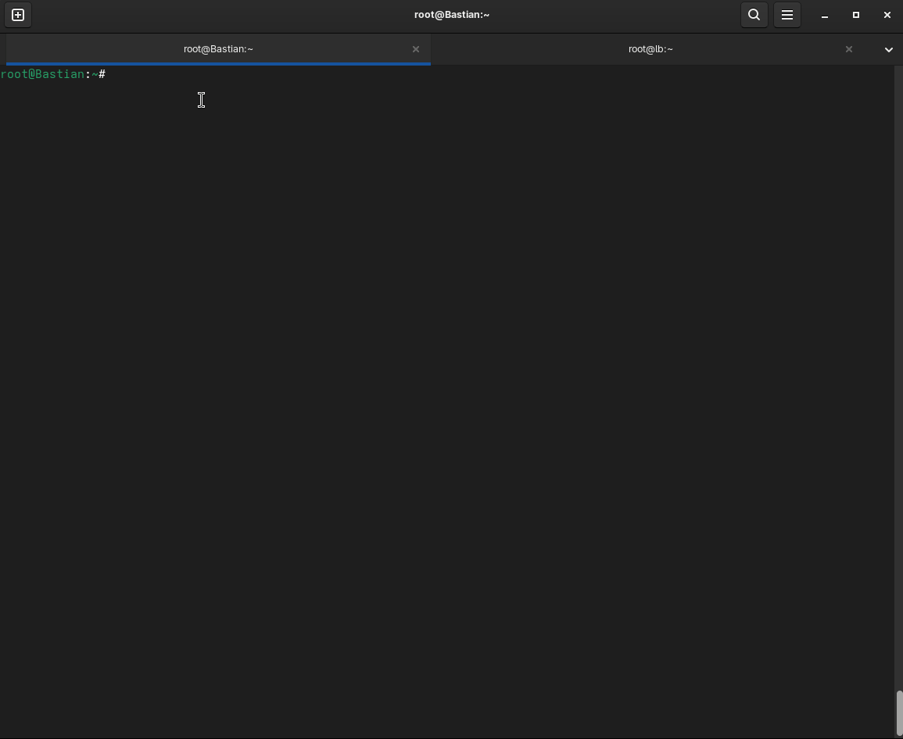


## 🔹 HAProxy Configuration on LB Host

```bash
dnf install haproxy -y
vim /etc/haproxy/haproxy.cfg
global
  log         127.0.0.1 local2
  pidfile     /var/run/haproxy.pid
  maxconn     4000
  daemon
defaults
  mode                    http
  log                     global
  option                  dontlognull
  option http-server-close
  option                  redispatch
  retries                 3
  timeout http-request    10s
  timeout queue           1m
  timeout connect         10s
  timeout client          1m
  timeout server          1m
  timeout http-keep-alive 10s
  timeout check           10s
  maxconn                 3000
listen api-server-6443 
  bind *:6443
  mode tcp
  option  httpchk GET /readyz HTTP/1.0
  option  log-health-checks
  balance roundrobin
  server bootstrap bootstrap.bm.tayyabtahir.com:6443 verify none check check-ssl inter 10s fall 2 rise 3 backup 
  server master1 master1.bm.tayyabtahir.com:6443 weight 1 verify none check check-ssl inter 10s fall 2 rise 3
  server master2 master2.bm.tayyabtahir.com:6443 weight 1 verify none check check-ssl inter 10s fall 2 rise 3
  server master3 master3.bm.tayyabtahir.com:6443 weight 1 verify none check check-ssl inter 10s fall 2 rise 3
listen machine-config-server-22623 
  bind *:22623
  mode tcp
  server bootstrap bootstrap.bm.tayyabtahir.com:22623 check inter 1s backup 
  server master1 master1.bm.tayyabtahir.com:22623 check inter 1s
  server master2 master2.bm.tayyabtahir.com:22623 check inter 1s
  server master3 master3.bm.tayyabtahir.com:22623 check inter 1s
listen ingress-router-443 
  bind *:443
  mode tcp
  balance source
  server worker1 worker1.bm.tayyabtahir.com:443 check inter 1s
  server worker2 worker2.bm.tayyabtahir.com:443 check inter 1s
listen ingress-router-80 
  bind *:80
  mode tcp
  balance source
  server worker1 worker1.bm.tayyabtahir.com:80 check inter 1s
  server worker2 worker2.bm.tayyabtahir.com:80 check inter 1s

```
Set boolean to allow all ports in haproxy.
```bash
setsebool -P haproxy_connect_any 1
systemctl restart haproxy
```

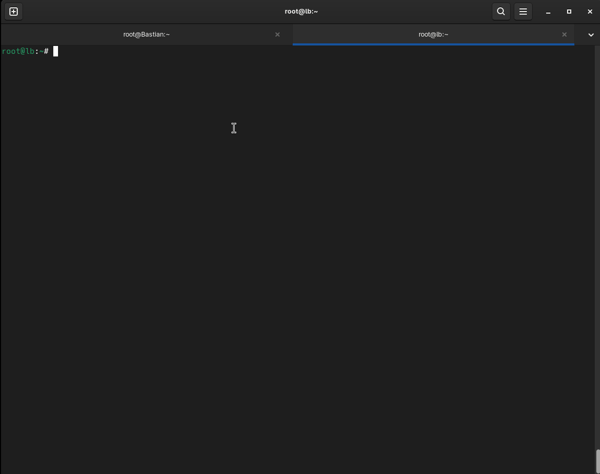

---

#Install openshift-install cli, oc and kubectl utilities on Bastian host.


```bash
dnf install -y wget git curl jq bind-utils

# Download Installer and CLI

Go to this link to get all required binaries:

https://console.redhat.com/openshift/install/metal/user-provisioned

OR

use the following links:
wget https://mirror.openshift.com/pub/openshift-v4/clients/ocp/latest/openshift-install-linux.tar.gz
wget https://mirror.openshift.com/pub/openshift-v4/clients/ocp/latest/openshift-client-linux.tar.gz

tar -xzf openshift-install-linux.tar.gz
sudo mv openshift-install /usr/local/bin/

tar -xzf openshift-client-linux.tar.gz
sudo mv oc kubectl /usr/local/bin/


oc version
openshift-install version
```
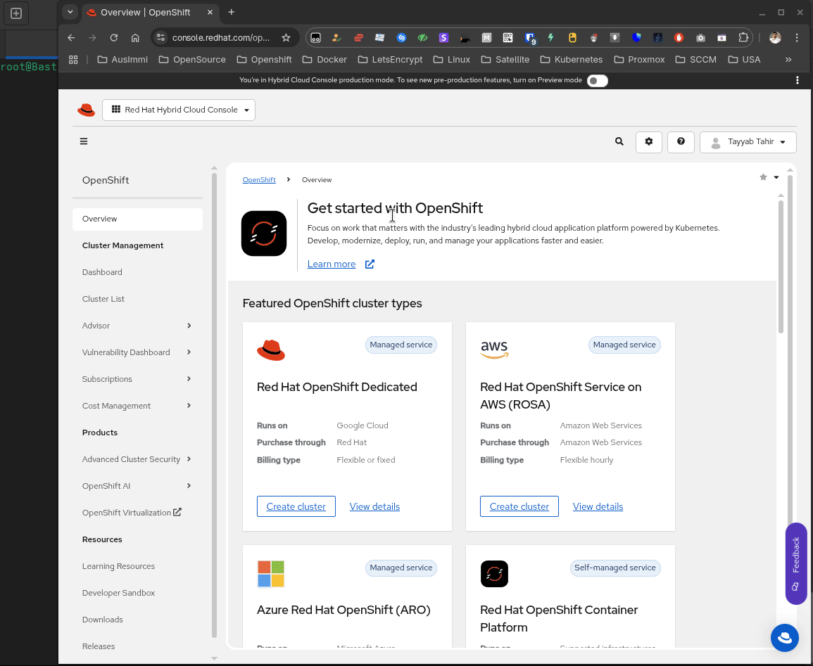


---

## 📚 Create install-config.yaml

```yaml
apiVersion: v1
baseDomain: tayyabtahir.com
compute:
- hyperthreading: Enabled
  name: worker
  replicas: 0
controlPlane:
  hyperthreading: Enabled
  name: master
  replicas: 3
metadata:
  name: bm
networking:
  clusterNetwork:
  - cidr: 10.128.0.0/14
    hostPrefix: 23
  networkType: OVNKubernetes
  serviceNetwork:
  - 172.30.0.0/16
platform:
  none: {}
fips: false
pullSecret: '{"auths": ...}'
sshKey: 'ssh-ed25519 AAAA...'
```


Generate SSH key on Bastian host and add in install-config.yaml file.


```bash
ssh-keygen


cat .ssh/id_ed6849.pub    #copy the key and add in install-config.yaml
```
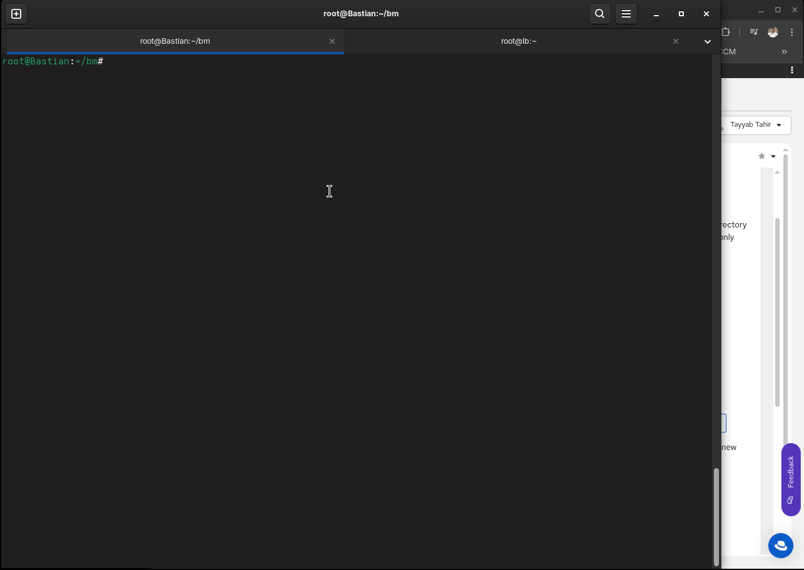

Copy the pull secret from Redhat Openshift Console: https://console.redhat.com/openshift/install/metal/user-provisioned, and add it to install-config.yaml file.


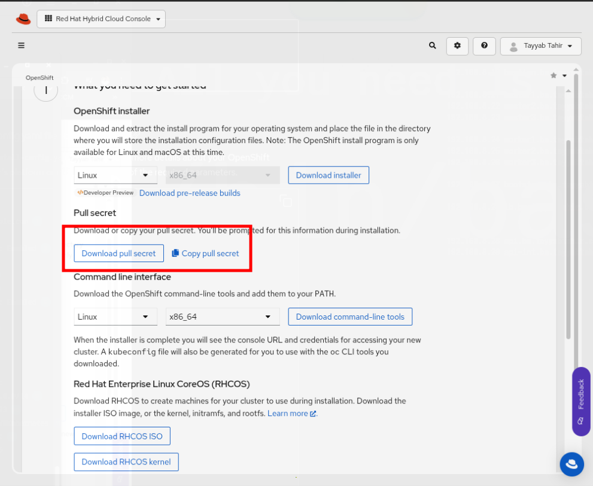


---

## 📆 Generate Manifests & Ignition Configs

create a folder and copy the install-config.yaml file in it.
Then generate manifests from ocp4 folder.


```bash
mkdir config

cp install-config.yaml config/

openshift-install create manifests --dir config
```


Check the mastersSchedulable parameter in the config/manifests/cluster-scheduler-02-config.yml Kubernetes manifest file is set to false. This setting prevents pods from being scheduled on the control plane machines

```bash
vim config/manifests/cluster-scheduler-02-config.yml
```

Locate the ```mastersSchedulable``` parameter and ensure that it is set to ```false```.


Then Generate ignition configs.

```bash
openshift-install create ignition-configs --dir config
```
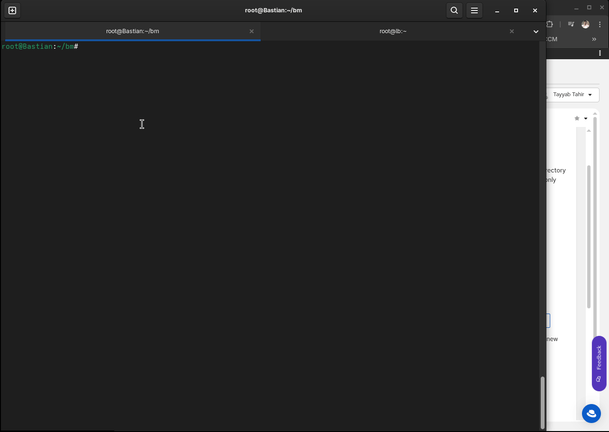

Ignition files have been generated. We need to upload them on the Bastian host web server.

## Configure web server on the Bastian host and upload the ignition configs.

Configure the webserver and move the bootstrap.ign file in document root directory.


```bash
dnf install httpd -y

mkdir /var/www/html/bm
cp *.ign /var/www/html/bm/
chmod 777 /var/www/html/bm/*.ign
systemctl enable httpd --now
```
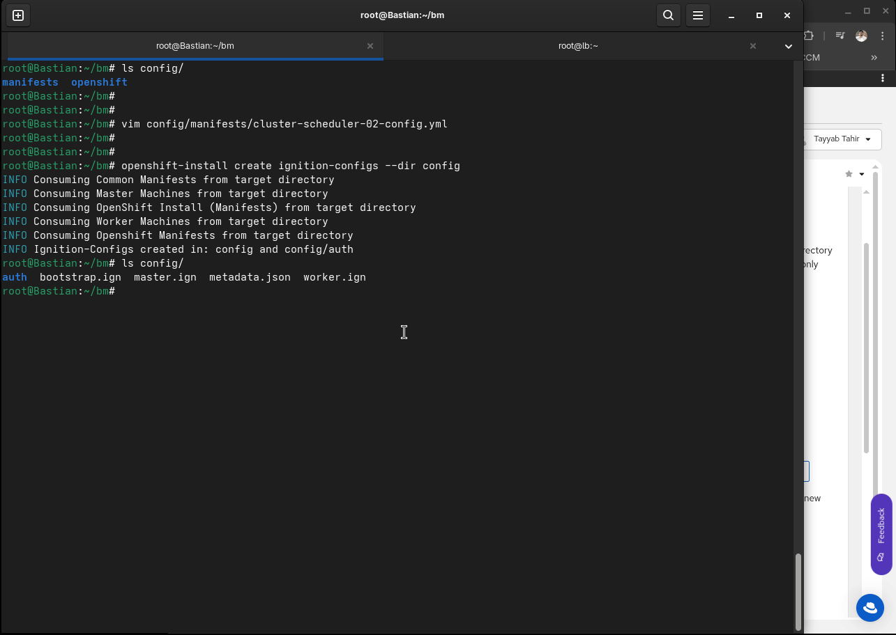

Verify If ignition files are accessible on webserver.

```bash
curl http://192.168.8.10/bm/bootstrap.ign
curl http://192.168.8.10/bm/master.ign
curl http://192.168.8.10/bm/worker.ign
```

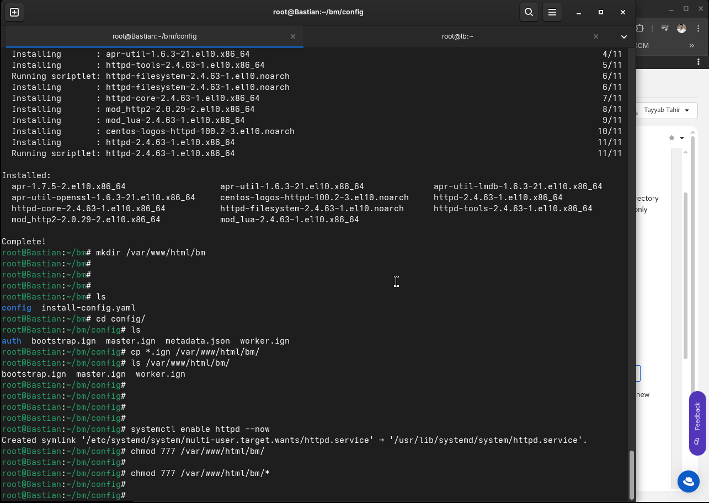

---
## 🚗 Prepare Machines for Boot.
Obtain the RHCOS ISO image from Red hat Openshift portal: https://console.redhat.com/openshift/install/metal/user-provisioned

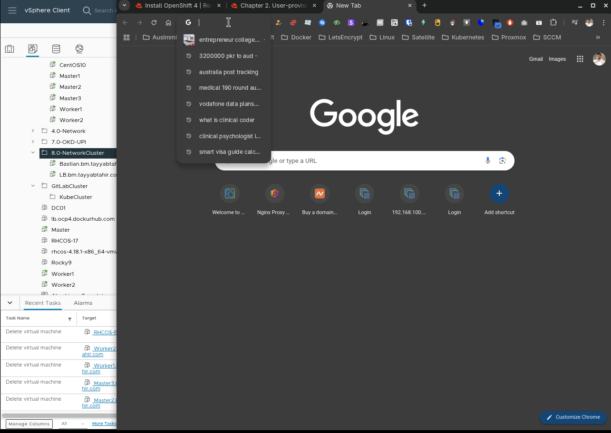

*If using baremetal devices, create a bootable USB with this ISO.
*If using hypervisor, upload the ISO on the datastore.

I am using vSphere, so I will create VMs on it. I have uploaded the ISO in datastore.

create the following VMs in vSphere:

1 x Bootstrap VM
3 x Master VMs
2 x Worker VMs


---

## MAC Address to IP Binding.
copy the mac addresses of all VMs and update them in dnsmasq file as per topology diagram.

```bash
vim /etc/dnsmasq.conf
dhcp-host=00:50:56:b3:c6:4a,192.168.4.27

dhcp-host=00:50:56:b3:55:92,192.168.4.21
dhcp-host=00:50:56:b3:69:09,192.168.4.22
dhcp-host=00:50:56:b3:6f:62,192.168.4.23

dhcp-host=00:50:56:b3:4b:50,192.168.4.24
dhcp-host=00:50:56:b3:24:01,192.168.4.25

systemctl restart dnsmasq.service
```
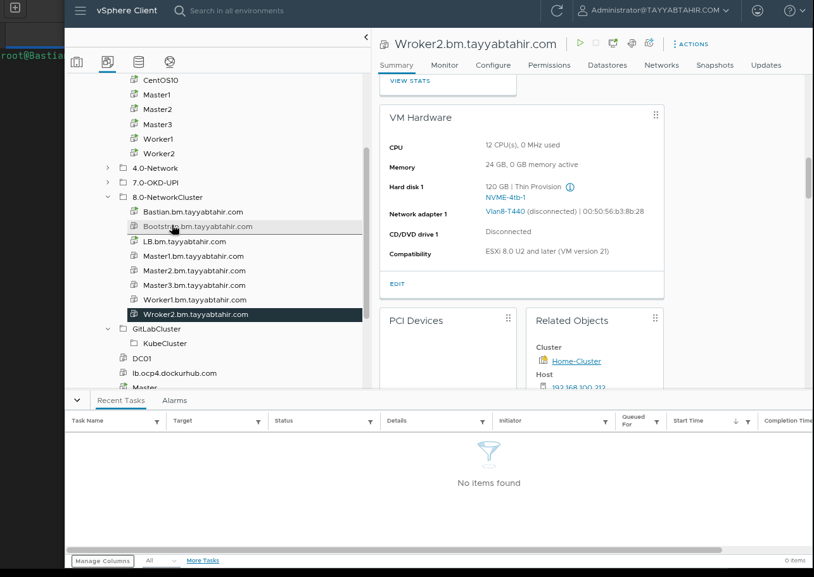

---

## ⏳ Bootstrap Completion
Start the bootstrap VM and verify if it has loaded the ignition file?
If yes, verify the IP address, hard disk name and run the following command then Restart the VM:

```bash
sudo coreos-installer install /dev/sda --ignition-url http://192.168.8.10/bm/bootstrap.ign --insecure-ignition
init 6
```


SSH the bootstrap node using core user from the bastian host and run the following commands to see the bootstrap bootkube logs :
monitor it for a while.
```bash
ssh core@bootstrap
journalctl -b -f -u release-image.service -u bootkube.service
```
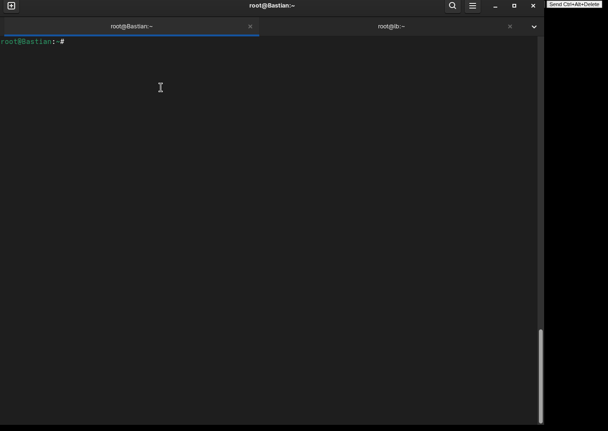

When you see the following logs:
It means, bootstrap is waiting for master nodes:

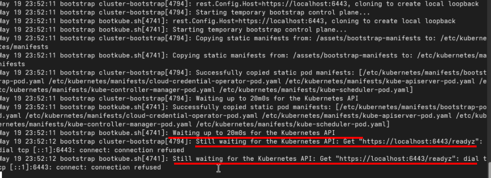

Turn all the master nodes on quickly and Do the same we did in bootstrap node.

```bash
ip -br -c a
lsblk

sudo coreos-installer install /dev/sda --ignition-url http://192.168.8.10/bm/master.ign --insecure-ignition
init 6

```
Run this command in bastian host installation directory: 
```bash
openshift-install wait-for bootstrap-complete --dir config --log-level=info
```


---
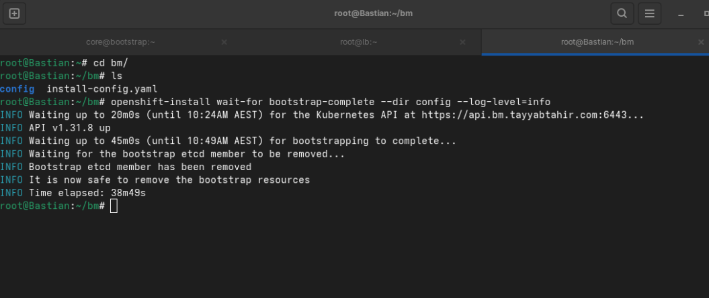

Once the "wait-for bootstrap-complete" command completed, Configure the kubeconfig file from the installation directory and verify the master nodes.


```bash
mkdir /root/.kube
cat ocp4/auth/kubeconfig > /root/.kube/config

oc get nodes
NAME      STATUS   ROLES                  AGE   VERSION
master1   Ready    control-plane,master   42m   v1.31.7
master2   Ready    control-plane,master   43m   v1.31.7
master3   Ready    control-plane,master   42m   v1.31.7
```
Once master nodes are ready, remove the bootstrap node and remove its entries from the haproxy as well.


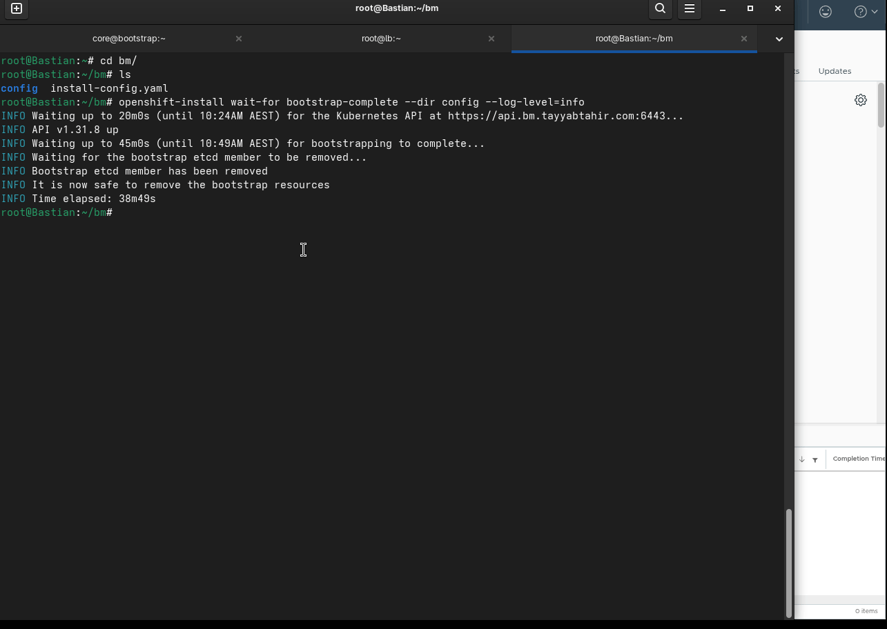


---

## 🤼‍♂️ Join Worker Nodes

Turn the Worker nodes on and follow the same steps that we did in bootstrap and master nodes:

```bash
ip -br -c a
lsblk

sudo coreos-installer install /dev/sda --ignition-url http://192.168.8.10/bm/master.ign --insecure-ignition
init 6

```
And wait for 10 to 20 minutes


check cluster operators:
```bash
oc get co
```

Few cluster operator are not in ready state becuase worker nodes are not available yet.

Worker nodes will be auto-registered. we just need to approve their certificates once they are registered.


Check if there is any certificate pending? if yes, approve them with the following command:

```bash
oc get nodes
oc get csr
oc get csr -o go-template='{{range .items}}{{if not .status}}{{.metadata.name}}{{"\n"}}{{end}}{{end}}' | xargs --no-run-if-empty oc adm certificate approve

```
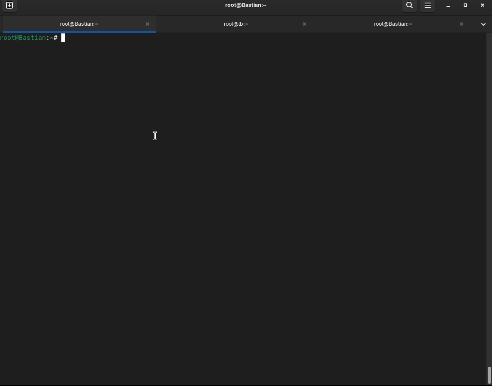


So worker nodes are also in ready state. lets verify the cluster operators:

```bash
oc get co
```

Few operators are still not ready. you can wait for 15 to 20 more minutes, all cluster operators should be available in true state

OR

you can delete the pods in their relevent projects and let the pods recreated.


---

## 🚀 Cluster Validation & OpenShift web console

```bash
oc get co
oc get nodes
oc get pods -A
oc get route -n openshift-console
```
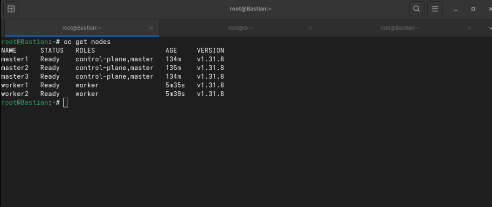

Open kubeadmin-password file in openshift installation directory /config/auth/.
It contain the kebeadmin password to access the web console.


```bash
cat /config/auth/kubeadmin-password
oc get route -n openshift-console


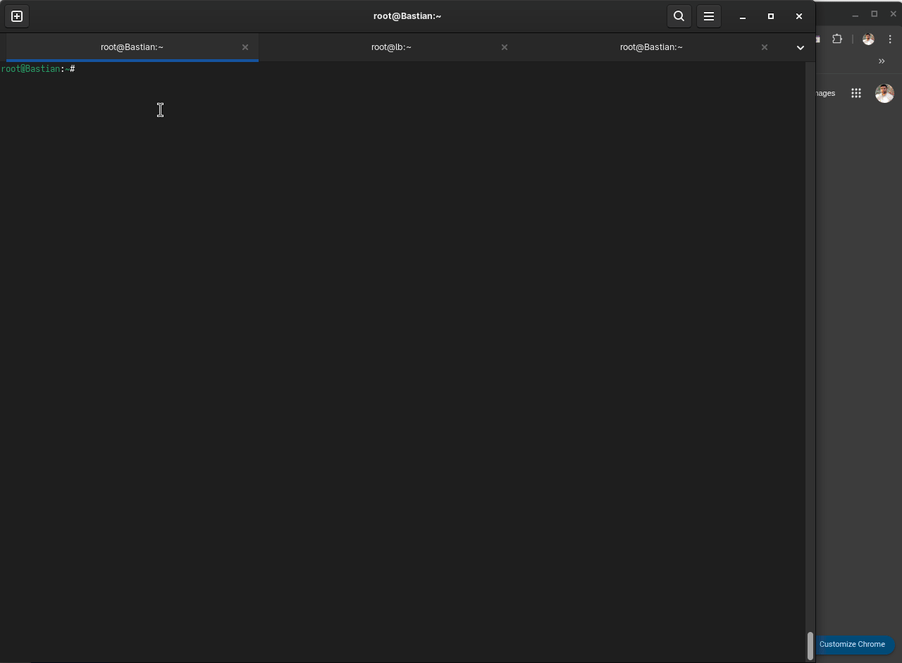

---


## 🔹 Resources

- [Official Docs](https://docs.redhat.com/en/documentation/openshift_container_platform/4.18/html/installing_on_bare_metal/user-provisioned-infrastructure)
- [Red Hat Pull Secret](https://console.redhat.com/openshift/install/pull-secret)
- [Red Hat OpenShift Console](https://console.redhat.com/openshift/install/metal/user-provisioned)

---

## 😎 Author

**Tayyab Tahir**
Senior DevOps Engineer
Email: Tayyabtahir@tayyabtahir.com
GitHub: [@tayyabtahir143](https://github.com/tayyabtahir143)

